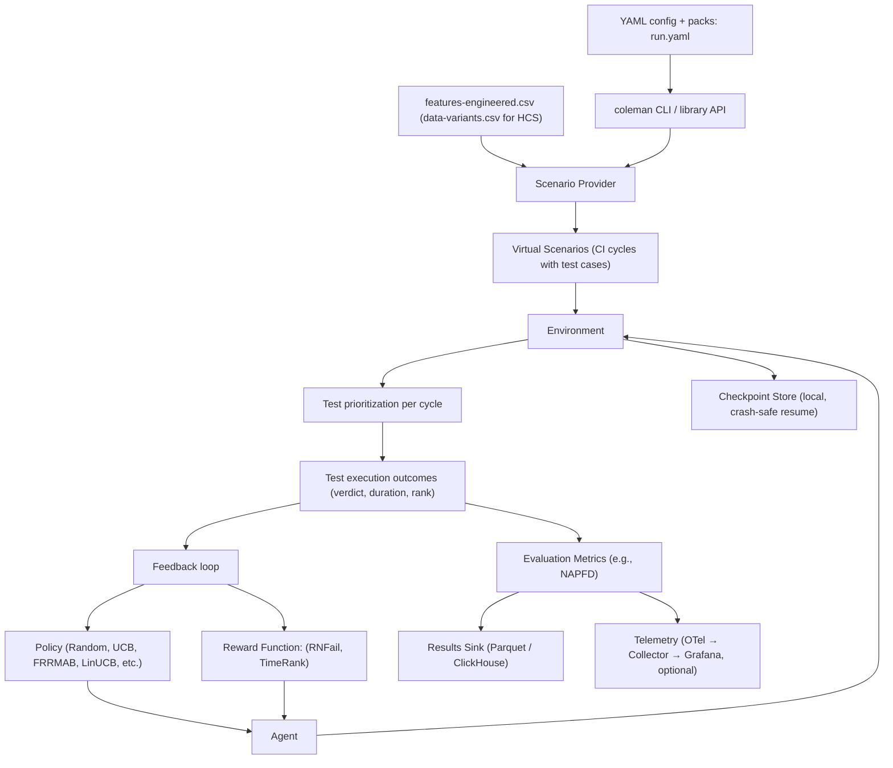

# Coleman4HCS

[](https://jacksonpradolima.github.io/coleman4hcs/)

[](https://sonarcloud.io/summary/new_code?id=jacksonpradolima_coleman4hcs)
[](https://sonarcloud.io/summary/new_code?id=jacksonpradolima_coleman4hcs)
[](https://sonarcloud.io/summary/new_code?id=jacksonpradolima_coleman4hcs)
[](https://sonarcloud.io/summary/new_code?id=jacksonpradolima_coleman4hcs)
[](https://codecov.io/github/jacksonpradolima/coleman4hcs)


### Solving the Test Case Prioritization using Multi-Armed Bandit Algorithms

**COLEMAN** (_**C**ombinatorial V**O**lati**LE** **M**ulti-Armed B**AN**dit_) is a Multi-Armed Bandit (MAB) based approach designed
to address the Test Case Prioritization in Continuous Integration (TCPCI) Environments in a cost-effective way.

We designed **COLEMAN** to be generic regarding the programming language in the system under test,
and adaptive to different contexts and testers' guidelines.

Modeling a MAB-based approach for TCPCI problem gives us some advantages in relation to studies found in the literature, as follows:

- It learns how to incorporate the feedback from the application of the test cases thus incorporating  diversity in the test suite prioritization;
- It uses a policy to deal with the Exploration vs Exploitation (EvE) dilemma, thus mitigating the problem of beginning without knowledge (learning) and adapting to changes in the execution environment, for instance, the fact that some test cases are added (new test cases) and removed (obsolete test cases) from one cycle to another (volatility of test cases);
- It is model-free. The technique is independent of the development environment and programming language, and does not require any analysis in the code level;
- It is more lightweight, that is, needs only the historical failure data to execute, and has higher performance.

In this way, this repository contains the COLEMAN's implementation.
For more information about **COLEMAN** read **Ref1** in [References](#references).

Furthermore, this repository contains the adaptation to deal with Highly-Configurable System (HCS) context through two strategies:
- **Variant Test Set Strategy** (VTS) that relies on the test set specific for each variant; and
- **Whole Test Set Strategy** (WST) that prioritizes the test set composed by the union of the test cases of all variants.

For more information about **WTS** and **VTS** read **Ref2** in [References](#references).

On the other hand, we extended **COLEMAN** to consider the context surrouding in each CI Cycle. The extended version
we named as **CONSTANTINE** (_**CON**textual te**S**t priori**T**iz**A**tion for co**NT**inuous **INE**gration_).

**CONSTANTINE** can use any feature given a dataset, for instance:
- Test Case Duration (Duration): The time spent by a test case to execute;
- Number of Test Ran Methods (NumRan): The number of test methods executed during the test, considering that some test
methods are not executed due to some previous test method(s) have been failed;
- Number of Test Failed Methods (NumErrors): The number of test methods which failed during the test.
- Test Case Age (TcAge): This feature measures how long the test case exists and is given by a number which
is incremented for each new CI Cycle in that the test case is used;
- Test Case Change (ChangeType): Considers whether a test case changed. If a test case is changed from a commit
to another, there is a high probability that the alteration was performed because some change in the software needs
to be tested. If the test case was changed, we could detect and consider if the test case was renamed, or it added
or removed some methods;
- Cyclomatic Complexity (McCabe): This feature considers the complexity of McCabe.
High complexity can be related to a more elaborated test case;
- Test Size (SLOC): Typically, size of a test case refers to either the lines of code or the number of
`assertions` in a test case. This feature is note correlated with coverage. For instance,
if we have two tests t_1 and t_2 and both cover a method, but t_2 have more assertions than t_1, consequently,
t_2 have higher chances to detect failures.

In order to use this `version`, use any Contextual-MAB available, for instance, LinUCB and SWLinUCB.

# Getting started

- [Coleman4HCS](#coleman4hcs)
    - [Solving the Test Case Prioritization using Multi-Armed Bandit Algorithms](#solving-the-test-case-prioritization-using-multi-armed-bandit-algorithms)
- [Getting started](#getting-started)
- [Citation](#citation)
- [Quick start](#quick-start)
  - [Library API](#library-api)
  - [CLI](#cli)
  - [Config packs](#config-packs)
  - [Sweep engine](#sweep-engine)
  - [Deterministic run_id](#deterministic-run_id)
  - [Provenance](#provenance)
- [Installation](#installation)
- [Development](#development)
- [Architecture: Results, Checkpoints & Telemetry](#architecture-results-checkpoints--telemetry)
- [Observability](#observability)
- [Datasets](#datasets)
- [About the files input](#about-the-files-input)
- [Using the tool](#using-the-tool)
  - [How data flows through Coleman4HCS](#how-data-flows-through-coleman4hcs)
  - [MAB Policies Available](#mab-policies-available)
  - [Running for Non-HCS System](#running-for-non-hcs-system)
  - [Running for an HCS system](#running-for-an-hcs-system)
    - [Whole Test Set Strategy](#whole-test-set-strategy)
    - [Variant Test Set Strategy](#variant-test-set-strategy)
- [Analysis of COLEMAN4HCS Performance](#analysis-of-coleman4hcs-performance)
  - [Performance Metrics](#performance-metrics)
  - [Methodologies](#methodologies)
  - [Visualizations](#visualizations)
- [References](#references)
- [Contributors](#contributors)
----------------------------------


# Citation

If this tool contributes to a project which leads to a scientific publication, I would appreciate a citation.

```
@Article{pradolima2020TSE,
  author  = {Prado Lima, Jackson A. and Vergilio, Silvia R.},
  journal = {IEEE Transactions on Software Engineering},
  title   = {A Multi-Armed Bandit Approach for Test Case Prioritization in Continuous Integration Environments},
  year    = {2020},
  pages   = {12},
  doi     = {10.1109/TSE.2020.2992428},
}

@article{pradolima2021EMSE,
  author  = {Prado Lima, Jackson A. and Mendon{\c{c}}a, Willian D. F. and Vergilio, Silvia R. and Assun{\c{c}}{\~a}o, Wesley K. G.},
  journal = {Empirical Software Engineering},
  title   = {{Cost-effective learning-based strategies for test case prioritization in Continuous Integration of Highly-Configurable Software}},
  year    = {2021}
}

```

# Quick start

Coleman4HCS ships a **typed, library-first experiment system** with
YAML configs, composable config packs, a sweep engine, and deterministic
`run_id` hashing.  External projects can `pip install coleman4hcs` and
drive experiments programmatically **or** via the `coleman` CLI — no repo
checkout required.

> **Breaking change** — the `CONFIG_FILE` environment variable, raw TOML
> dict workflow, and `main.py` entry-point are removed.  Configuration is now
> handled via YAML configs, typed Pydantic v2 models, config packs, and
> the `coleman` CLI.

## Library API

```python
from coleman4hcs.spec import RunSpec, SweepSpec, SweepAxis, compute_run_id
from coleman4hcs.api  import run, run_many, sweep

# 1. Define a spec
spec = RunSpec(
    experiment={"datasets": ["alibaba@druid"], "policies": ["UCB"], "rewards": ["RNFail"]},
    results={"out_dir": "./runs"},
)

# 2. Deterministic run_id — same config always produces the same ID
assert compute_run_id(spec) == compute_run_id(spec)

# 3. Single run
result = run(spec)
print(result.run_id, result.artifacts_dir)

# 4. Parameter sweep (grid × seeds)
specs = sweep(spec, SweepSpec(
    axes=[SweepAxis(mode="grid", params={"algorithm.ucb.rnfail.c": [0.1, 0.3, 0.5]})],
    seeds=[0, 1, 2],
))  # 3 values × 3 seeds = 9 specs

results = run_many(specs, max_workers=4)
```

| Function | Description |
|----------|-------------|
| `run(spec)` | Execute a single experiment from a resolved `RunSpec` |
| `run_many(specs, max_workers=)` | Execute multiple specs, optionally in parallel |
| `sweep(base, sweep_spec)` | Expand a base spec × sweep definition into concrete specs |
| `load_spec(path)` | Load and validate a `RunSpec` from YAML (with pack resolution) |
| `save_resolved(spec, path)` | Persist a resolved spec as canonical JSON |

## CLI

The `coleman` console script is installed automatically with the package:

```bash
# Execute a single run
coleman run --config run.yaml

# Parameter sweep (grid mode)
coleman sweep --config base.yaml \
    --grid algorithm.ucb.rnfail.c=0.1,0.3,0.5 \
    --grid execution.seed=range(0,20) \
    --workers 4

# Dry-run — print generated specs without executing
coleman sweep --config base.yaml --grid execution.seed=range(0,5) --dry-run

# Validate a config and optionally write the resolved spec
coleman validate --config base.yaml --resolve resolved.json
```

## Config packs

Config packs are composable YAML fragments under `packs/`.  Reference them
with the `packs` key in your config and inline overrides win:

```yaml
# my-experiment.yaml
packs:
  - policy/linucb
  - reward/rnfail
  - results/parquet
  - telemetry/off

experiment:
  datasets: ["alibaba@druid"]
  policies: ["LinUCB"]

execution:
  independent_executions: 30
```

Shipped starter packs:

| Pack | Category | Contents |
|------|----------|----------|
| `policy/linucb` | Policy | LinUCB with default alpha values |
| `reward/rnfail` | Reward | RNFail reward function |
| `runtime/local` | Runtime | Single-process local execution |
| `results/parquet` | Results | Parquet sink with defaults |
| `telemetry/off` | Telemetry | Telemetry disabled |

## Sweep engine

The sweep engine supports **grid** (Cartesian product) and **zip** (paired)
modes, with optional seed replication:

```python
from coleman4hcs.spec import SweepSpec, SweepAxis, expand_sweep, RunSpec

base = RunSpec()
sweep_spec = SweepSpec(
    axes=[
        SweepAxis(mode="grid", params={
            "algorithm.ucb.rnfail.c": [0.1, 0.3, 0.5],
            "execution.parallel_pool_size": [1, 4],
        }),
    ],
    seeds=[0, 1, 2],
)
specs = expand_sweep(base, sweep_spec)
# 3 × 2 × 3 seeds = 18 specs, deterministic order
```

- **Grid mode** — Cartesian product of all parameter lists
- **Zip mode** — paired lists (must have equal length, raises `ValueError` otherwise)
- **Seeds** — each base spec is replicated per seed; the seed is stored on `ExecutionSpec.seed` and affects `run_id`

## Deterministic run_id

Every `RunSpec` hashes to a deterministic 12-character identifier:

```
run_id = sha256(canonical_json(resolved_spec))[:12]
```

- **Canonical JSON**: sorted keys, compact separators (`json.dumps(sort_keys=True, separators=(",", ":"))`)
- **Same config → same `run_id` → same output directory**
- Provenance files and artifacts are written to `<out_dir>/<run_id>/`

## Provenance

Each run persists:

| File | Contents |
|------|----------|
| `spec.resolved.json` | The fully resolved `RunSpec` as canonical JSON |
| `provenance.json` | Git commit, dirty flag, Python version, `uv.lock` hash |

# Installation

## As a library (recommended for new projects)

Install Coleman4HCS as a dependency in your project:

```bash
pip install coleman4hcs
```

Or with optional extras:

```bash
pip install coleman4hcs[telemetry]     # OpenTelemetry SDK
pip install coleman4hcs[clickhouse]    # ClickHouse results sink
```

Then use the [Library API](#library-api) or the [`coleman` CLI](#cli) to
drive experiments — no repo checkout required.

## From source (for development)

To develop or modify the tool, follow these steps:

1. Clone the repository:

```shell
git clone git@github.com:jacksonpradolima/coleman4hcs.git
cd coleman4hcs
```

2. Install [UV](https://docs.astral.sh/uv/) – a fast Python package manager.

3. Install dependencies:

```shell
uv sync
```

4. Install the project locally in editable mode:

```shell
uv pip install -e .
```

5. Create a YAML config file (see [Quick start](#quick-start) for
   the config format) and run with the `coleman` CLI:

```bash
coleman run --config my-experiment.yaml
```

# Development

This project uses a `Makefile` to streamline common development tasks. Run `make help` to see all available commands.

| Command                  | Description                          |
|--------------------------|--------------------------------------|
| `make install`           | Full dev setup (all extras + editable install) |
| `make pre-commit-install`| Install pre-commit hooks             |
| `make test`              | Run tests with pytest                |
| `make lint`              | Run the ruff linter                  |
| `make format`            | Run the ruff formatter               |
| `make docs`              | Build documentation with Zensical    |
| `make help`              | Show all available Make targets      |

## DevContainer (recommended)

The fastest way to start developing is with a [DevContainer](https://containers.dev/). Open the repo in VS Code or any DevContainer-compatible editor and select **"Reopen in Container"** — **everything works out of the box**, including the full observability stack.

**What happens automatically:**

1. Python 3.14 + uv + all dependencies (including telemetry & ClickHouse extras) are installed *(on create)*
2. Pre-commit hooks are configured *(on create)*
3. The **observability stack** (OTel Collector + Prometheus + Grafana + ClickHouse) starts via Docker-in-Docker *(on every start)*
4. **Telemetry** can be enabled via the `telemetry/local` pack *(swap `telemetry/off` for `telemetry/local` in `run.yaml`)*

After the container builds, just run your experiment:

```bash
coleman run --config run.yaml
```

Grafana is already live at http://localhost:3000 — open it in your browser to see metrics in real-time.

**Other useful commands:**

```bash
make test           # run the test suite
make lint           # lint with ruff
make docs-serve     # preview docs locally
```

**What's included in the DevContainer:**

| What | Why |
|------|-----|
| Python 3.14 + [uv](https://docs.astral.sh/uv/) | The project's package manager |
| Docker-in-Docker | Runs the observability stack automatically |
| VS Code extensions | Ruff, Pylance, Pyright, Copilot, TOML, Jupyter, etc. |
| Telemetry + ClickHouse extras | Pre-installed — no extra `pip install` needed |
| OTel Collector + Prometheus + Grafana + ClickHouse | Started automatically on container start |
| Port forwarding | All service ports mapped to your host (see table below) |

**Forwarded ports (all accessible from your host browser):**

| Port | Service | URL |
|------|---------|-----|
| 3000 | Grafana | http://localhost:3000 |
| 9090 | Prometheus | http://localhost:9090 |
| 4317 | OTel Collector (gRPC) | — (used by the framework) |
| 4318 | OTel Collector (HTTP) | — (used by the framework) |
| 8889 | Prometheus metrics | http://localhost:8889/metrics |
| 8123 | ClickHouse (HTTP) | http://localhost:8123 |
| 9000 | ClickHouse (native) | — |

> **ClickHouse sink remains optional.** The service is running in DevContainer,
> but you still need `sink: "clickhouse"` in your results config or use
> a ClickHouse results pack if you want results persisted to ClickHouse instead of Parquet.

# Architecture: Results, Checkpoints & Telemetry

Coleman4HCS is **framework-first**: `coleman run --config run.yaml` works with zero external
services.  All monitoring is split into three independent layers that can be
enabled or disabled individually:

| Layer | Purpose | Default | Optional |
|-------|---------|---------|----------|
| **Results** | Persist experiment facts (NAPFD, APFDc, …) | Partitioned Parquet (zstd) | ClickHouse sink |
| **Checkpoints** | Crash-safe resume | Local filesystem (pickle + `progress.json`) | — |
| **Telemetry** | Observability (latency, throughput) | Disabled (NoOp) | OpenTelemetry + Collector |

When a layer is disabled its module resolves to a **null implementation** with
near-zero overhead (`NullSink`, `NullCheckpointStore`, `NoOpTelemetry`).

## Configuration

All settings live in `run.yaml` and composable config packs under `packs/`.
See [Configuration](docs/configuration.md) for the full YAML schema reference.

```yaml
# run.yaml — default configuration using packs
packs:
  - execution/default        # parallel_pool_size: 10, independent_executions: 10
  - experiment/alibaba_druid # datasets, rewards, policies
  - algorithm/defaults       # FRRMAB, UCB, EpsilonGreedy, LinUCB, SWLinUCB params
  - results/parquet          # Parquet sink with default settings
  - checkpoint/default       # checkpoint enabled, interval: 50000
  - telemetry/off            # telemetry disabled (swap for telemetry/local to enable)

# Inline overrides (applied on top of packs):
# execution:
#   parallel_pool_size: 4
```

## Optional extras

```bash
# Telemetry (OpenTelemetry SDK)
pip install coleman4hcs[telemetry]

# ClickHouse results sink
pip install coleman4hcs[clickhouse]
```

## Querying results

Results are written as Hive-partitioned Parquet files under `./runs/`.  You
can query them directly with DuckDB (already a project dependency):

For a guided end-to-end example covering configuration, observability,
resume/recovery, export, and final analysis, see [docs/workflow.py](docs/workflow.py).

```sql
-- Average NAPFD per policy
SELECT policy, AVG(fitness) AS avg_napfd
FROM read_parquet('./runs/**/*.parquet', hive_partitioning=1)
GROUP BY policy
ORDER BY avg_napfd DESC;

-- Cost distribution per reward function
SELECT reward_function,
       PERCENTILE_CONT(0.5) WITHIN GROUP (ORDER BY cost) AS median_cost
FROM read_parquet('./runs/**/*.parquet', hive_partitioning=1)
GROUP BY reward_function;
```

# Observability

> **Framework-first guarantee:** `coleman run --config run.yaml` works without Docker or
> any of these services.  The observability stack is **optional** for local
> installs, but **enabled automatically** in the DevContainer.

Coleman4HCS ships with a local observability stack (OTel Collector + Prometheus + Grafana)
for real-time metrics and traces during experiments.

## Using the DevContainer (zero-step setup)

If you develop inside the DevContainer, **everything is already running**.
The post-start hook automatically:

1. Starts the OTel Collector + Prometheus + Grafana + ClickHouse via Docker Compose
2. Telemetry can be enabled via the `telemetry/local` pack in `run.yaml`

The `telemetry` and `clickhouse` pip extras are installed during container creation.

Just run your experiment and open Grafana:

```bash
coleman run --config run.yaml
# Open http://localhost:3000 → metrics appear in real-time
```

No manual steps required.

## Local setup (without DevContainer)

If you're **not** using the DevContainer, follow these steps:

```bash
# 1. Start the observability stack
cd examples/observability
docker compose up -d

# 2. Install telemetry extras
uv pip install coleman4hcs[telemetry]

# 3. Enable telemetry in your run.yaml:
#    Replace telemetry/off with telemetry/local in the packs list

# 4. Run experiments — metrics flow to Grafana
coleman run --config run.yaml
```

## Port reference

| Port | Service | URL |
|------|---------|-----|
| **3000** | Grafana | http://localhost:3000 |
| **4317** | OTel Collector (gRPC) | — (used by the framework) |
| **4318** | OTel Collector (HTTP) | — (used by the framework, default endpoint) |
| **8889** | Prometheus metrics | http://localhost:8889/metrics |
| **8123** | ClickHouse (HTTP) | http://localhost:8123 *(auto-started in DevContainer; local: `--profile clickhouse`)* |
| **9000** | ClickHouse (native) | — *(auto-started in DevContainer; local: `--profile clickhouse`)* |

## Metric names

| Metric | Type | Description |
|--------|------|-------------|
| `coleman.cycles_total` | Counter | Total experiment cycles processed |
| `coleman.bandit_update_latency` | Histogram (s) | Bandit arm-update latency |
| `coleman.prioritization_latency` | Histogram (s) | Test-case prioritization latency |
| `coleman.evaluation_latency` | Histogram (s) | Evaluation step latency |
| `coleman.napfd` | Histogram | NAPFD score distribution |
| `coleman.apfdc` | Histogram | APFDc score distribution |

### Cardinality rules

- **No `step` label** in metrics (would create unbounded cardinality).
- `run_id` is a resource attribute, not a metric label.
- Per-step detail is available in **traces** (span attributes).

## Adding ClickHouse (optional)

In the DevContainer, ClickHouse is already started by the post-start hook.
For local setups, start ClickHouse alongside the existing stack:

```bash
cd examples/observability
docker compose --profile clickhouse up -d
```

Then switch the results sink in your `run.yaml`:

```yaml
results:
  sink: clickhouse
```

```bash
# Run experiments — results go to the coleman_results table
coleman run --config run.yaml
```

The ClickHouse extras are already installed in the DevContainer.  For local
installs run `uv pip install coleman4hcs[clickhouse]` first.

## Tear down

```bash
cd examples/observability
docker compose --profile clickhouse down -v
```

# Datasets

The datasets used in the examples (and much more datasets) are available at [Harvard Dataverse Repository](https://dataverse.harvard.edu/dataverse/gres-ufpr).
You can create your own dataset using out [GitLab CI - Torrent tool](https://github.com/jacksonpradolima/gitlabci-torrent) or our adapted version from [TravisTorrent tool](https://github.com/jacksonpradolima/travistorrent-tools).
Besides that, you can extract relevant information about each system using our tool named [TCPI - Dataset - Utils](https://github.com/jacksonpradolima/tcpci-dataset-utils).

# About the files input

**COLEMAN** considers two kind of *csv files*: **features-engineered** and **data-variants**.
The second file, **data-variants.csv**, is used by the HCS, and it represents all results from all variants.
The information is organized by commit and variant.

- **features-engineered.csv** contains the following information:
  - **Id**: unique numeric identifier of the test execution;
  - **Name**: unique numeric identifier of the test case;
  - **BuildId**: a value uniquely identifying the build;
  - **Duration**: approximated runtime of the test case;
  - **LastRun**: previous last execution of the test case as *DateTime*;
  - **Verdict**: test verdict of this test execution (Failed: 1, Passed: 0).

- **data-variants.csv** contains all information that **features-engineered.csv** has, and in addition the following information:
  - **Variant**: variant name.

In this way,  **features-engineered.csv** organize the information for a single system or variant, and
**data-variants.csv** track the information for all variants used during the software life-cycle (for each commit).

During the **COLEMAN**'s execution, we use **data-variants** to identify the variants used in a current commit and apply the **WTS** strategy.

For **CONSTANTINE**, additional columns can be used and represents a contextual information. In this way, you define
what kind of information can be used!

#  Using the tool

## How data flows through Coleman4HCS



To use COLEMAN, you need to provide the necessary configurations. This includes setting up environment variables and configuration files.

Configure the utility by editing the `run.yaml` file located in the project's root directory.
The file uses composable config packs for a clean, modular setup — each pack provides
defaults for one concern.  Add inline overrides below the `packs:` list to customise settings.

Here's an example `run.yaml` file:

```yaml
# run.yaml — Default Run Configuration
packs:
  - execution/default        # parallel_pool_size: 10, independent_executions: 10
  - experiment/alibaba_druid # datasets, rewards, policies
  - algorithm/defaults       # FRRMAB, UCB, EpsilonGreedy, LinUCB, SWLinUCB params
  - results/parquet          # Parquet sink
  - checkpoint/default       # checkpoint enabled
  - telemetry/off            # telemetry disabled
  - reward/rnfail            # RNFail reward
  - hcs/off                  # HCS disabled
  - contextual/default       # contextual information defaults

# Inline overrides (applied on top of packs):
execution:
  parallel_pool_size: 4
experiment:
  datasets:
    - square@retrofit
```

**where:**
- Execution Configuration:
  - `parallel_pool_size` is the number of threads to run **COLEMAN** in parallel.
  - `independent_executions` is the number of independent experiments we desire to run.
- Experiment Configuration:
  - `scheduled_time_ratio` represents the Schedule Time Ratio, that is, time constraints that represents the time available to run the tests. **Default**: 0.1 (10%), 0.5 (50%), and 0.8 (80%) of the time available.
  - `datasets_dir` is the directory that contains your system. For instance, we desire to run the algorithm for the systems that are inside the directory **data**.
  - `datasets` is an array that represents the datasets to analyse. It's the folder name inside `datasets_dir` which contains the required file inputs.
  - `experiment_dir` is the directory where we will save the results.
  - `rewards` defines the reward functions to be used, available RNFailReward and TimeRankReward (See **Ref1** in [References](#references)).
  - `policies` selects the Policies available on **COLEMAN**, such as Random, Greedy, EpsilonGreedy, UCB, and FRRMAB.
- Algorithm Configuration: each algorithm has its own individual configuration. Next, we present some of them:
  - FRRAB:
    - `window_sizes` is an array that contains the sliding window sizes
    - `c` is the scaling factor. It's defined for each reward function used.
  - UCB:
    - `c` is the scaling factor. It's defined for each reward function used.
  - Epsilon-Greedy:
    - `epsilon` is the epsilon value. It's defined for each reward function used.
- HCS Configuration:
  - `wts_strategy` represents the usage of Whole Test Set (WTS) Strategy for a system HCS (See [Whole Test Set Strategy](#whole-test-set-strategy)).
- Contextual Information:
  - Config
    - `previous_build` what kind of information we obtain from previous build and not in the current one. For
      instance, the test case duration (`Duration`) will _know_ only after the test execution.
  - Feature Group
    - `feature_group_name` represent the name of a feature group. We can create different groups of feature to
      evaluate the influence of each one.
    - `feature_group_values` represent the features selected to be used by the Contextual MAB.


##  MAB Policies Available

The following MAB Policies are available on **COLEMAN**:

| **Policy**        | **Description**                                                                                                                                                                                                                         | **Use Case**                                                                                                                    |
|-------------------|-----------------------------------------------------------------------------------------------------------------------------------------------------------------------------------------------------------------------------------------|----------------------------------------------------------------------------------------------------------------------------------|
| **Random**        | Selects actions purely based on random choice without any preference.                                                                                                                                                                   | Used as a baseline to compare with other more sophisticated policies. Doesn't use prior knowledge.                               |
| **Greedy**        | Always selects the action with the highest estimated reward. Exploits current knowledge without exploring other options.                                                                                                                | Effective in environments where reward probabilities are static and unchanging.                                                  |
| **EpsilonGreedy** | This is a variation of the Greedy policy. With probability \( \epsilon \), a random action is selected (exploration), and with probability \( 1 - \epsilon \), the action with the highest estimated reward is selected (exploitation). | Useful in environments with uncertainty about the optimal action or when the environment changes over time.                       |
| **UCB**           | Selects actions based on both their estimated rewards and the uncertainty around these rewards. Balances exploration and exploitation.                                                                                                  | Effective when trials are limited and there's a need to explore and exploit simultaneously.                                       |
| **SlMAB**         | Sliding-window Multi-Armed Bandit (SlMAB) approach, which uses a fixed-size sliding window to consider only recent feedback. The window size determines the trade-off between short-term and long-term rewards.                         | Suitable for non-stationary environments where the optimal action can change over time and recent actions are more indicative.    |
| **FRRMAB**        | A more sophisticated MAB policy that considers feedback from previous actions using a sliding window to adjust estimated rewards for future decisions.                                                                                  | Beneficial in dynamic environments where actions' reward probabilities change and feedback from previous actions is valuable.     |

and the following Contextual MABs for **CONSTANTINE**:

| **Policy**        | **Description**                                                                                                                                                                                                                         | **Use Case**                                                                                                                    |
|-------------------|-----------------------------------------------------------------------------------------------------------------------------------------------------------------------------------------------------------------------------------------|----------------------------------------------------------------------------------------------------------------------------------|
| **LinUCB**        | Incorporates linear regression with UCB. Uses contextual information of the arms to estimate the reward. The uncertainty bonus is combined with a linear estimate of the expected reward.                                                    | Best for environments with contextual information where the relationship between context and reward can be linearly approximated. |
| **SWLinUCB**      | A combination of LinUCB and sliding window approach. It uses the recent contextual information of the arms within a sliding window to better estimate the reward in non-stationary environments.                                         | Ideal for non-stationary environments with contextual information where recent context-reward relationships are more indicative.  |

Note: you can execute all the MAB and Contextual MAB policies together if you have the proper data input.

## Running for Non-HCS System

To execute **COLEMAN** for a non-HCS system, first update the experiment settings in your `run.yaml` (or override inline):

- `datasets_dir: examples`
- `datasets: [fakedata]`

Subsequently, you can run the program with the following command:

```
coleman run --config run.yaml
```

## Running for an HCS system

For HCS systems, we provide two distinct strategies to determine optimal solutions for variants:
**WTS** (Whole Test Set Strategy) and **VTS** (Variant Test Set Strategy).
You can learn more about these in **Ref2** under the [References](#references) section.

When employing the **WTS** and **VTS** strategies, regard `datasets_dir` as the directory housing your system.
For the **WTS** approach, variants of a system are discerned from subfolders within the `datasets_dir` directory.
Essentially, `datasets_dir` symbolizes the project name.
This differentiation in execution methodology between HCS and non-HCS systems is crucial,
alongside the `wts_strategy` variable. For clarity, please inspect our example directory.

### Whole Test Set Strategy

The **WTS** strategy prioritizes the test set composed by the union of the test cases of all variants.
To employ this strategy, set in your `run.yaml`:

- `hcs_configuration.wts_strategy: true`

For a practical demonstration, set `datasets = ["dune@total"]`
(a dataset amalgamating test cases from all variants)
and `datasets_dir = "examples/core@dune-common"`.
This provides a concise example using the Dune dataset.
More details on the dataset are available under [Datasets](#datasets).

### Variant Test Set Strategy

Contrastingly, the **VTS** approach evaluates each variant as an isolated system.
To harness this strategy, set in your `run.yaml`:

- `hcs_configuration.wts_strategy: false`

As example, use `datasets = ["dune@debian_10 clang-7-libcpp-17", "dune@debian_11 gcc-10-20",
"dune@ubuntu_20_04 clang-10-20"]` and `datasets_dir = "examples/core@dune-common"`
to run one small example using Dune dataset (See [Datasets](#datasets)).
Now, we consider each variant as single system.

As a hands-on example, set `datasets =
["dune@debian_10 clang-7-libcpp-17", "dune@debian_11 gcc-10-20", "dune@ubuntu_20_04 clang-10-20"]`
and `datasets_dir = "examples/core@dune-common"`.
This offers a succinct example using the Dune dataset, treating each variant as a unique system.
Further insights into the dataset are available in the [Datasets](#datasets) section.

# Analysis of COLEMAN4HCS Performance

As part of our ongoing effort to provide the state-of-the-art tool, Coleman4HCS, for TCPCI optimize COLEMAN4HCS, we've created examples to guide any researcher to understand the performance, effectiveness, and adaptability of our tool. The analysis, available in our [marimo notebook](notebooks/analysis.py) (and the original [Jupyter notebook](notebooks/analysis.ipynb)), leverages various libraries such as DuckDB, Pandas, Seaborn, and Matplotlib to process data and visualize the results.

## Performance Metrics

The notebook has examples including but not limited to test case execution times, prioritization effectiveness, and algorithm efficiency under different configurations and environments.

## Methodologies

The notebook employs SQL queries for data manipulation and leverages Python's data analysis and visualization libraries to derive meaningful insights from historical test data. Our methodology ensures a robust analysis framework capable of handling large datasets and producing actionable intelligence.

## Visualizations

Data visualizations play a key role in our analysis, offering intuitive understanding of complex data patterns and algorithm performance. The notebook includes various charts and graphs that elucidate the trade-offs between different prioritization strategies and their impact on test cycle times and failure detection rates.

# References

- 📖 [**Ref1**] [A Multi-Armed Bandit Approach for Test Case Prioritization in Continuous Integration Environments](https://doi.org/10.1109/TSE.2020.2992428) published at **IEEE Transactions on Software Engineering (TSE)**

[](https://www.youtube.com/watch?v=w8Lf0VEWkQk)

- 📖 [**Ref2**] [Learning-based prioritization of test cases in continuous integration of highly-configurable software](https://doi.org/10.1145/3382025.3414967) published at **Proceedings of the 24th ACM Conference on Systems and Software Product Line (SPLC'20)**


[](https://www.youtube.com/watch?v=tT8Ygt8jCKg)

# Contributors

Please see our [Contributing Guidelines](CONTRIBUTING.md) if you'd like to contribute.

For vulnerability reports, refer to our [Security Policy](SECURITY.md).

- 👨‍💻 Jackson Antonio do Prado Lima <a href="mailto:jacksonpradolima@gmail.com">:e-mail:</a>

<a href="https://github.com/jacksonpradolima/coleman4hcs/graphs/contributors">
  
</a>
